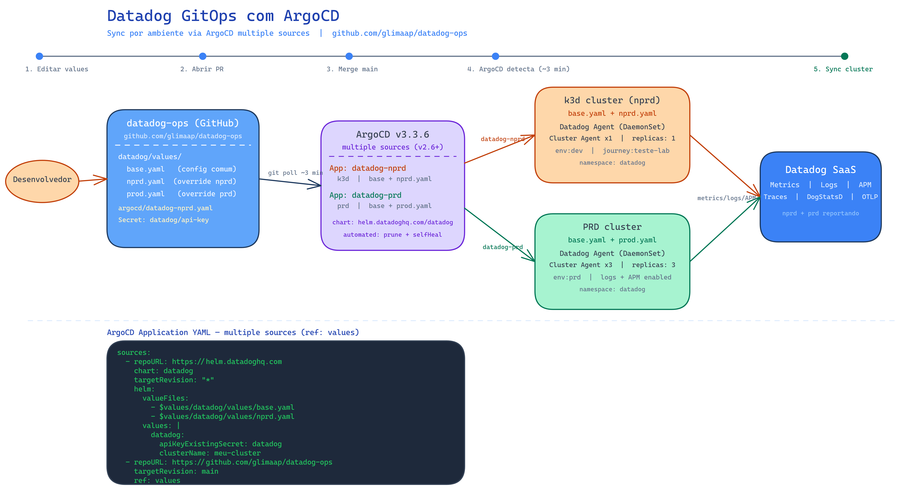

# ArgoCD — Sync de Helm Chart com Values por Ambiente

Guia passo a passo para configurar o ArgoCD para sincronizar o Datadog Agent via Helm chart, aplicando arquivos de values diferentes por ambiente (nprd e prd), a partir de um repositório Git.

---

## Visão Geral da Arquitetura



```
GitHub (datadog-ops)
└── datadog/values/
    ├── base.yaml    → values comuns a todos os ambientes
    ├── nprd.yaml    → overrides para não-produção (k3d)
    └── prod.yaml    → overrides para produção

ArgoCD
├── Application: datadog-nprd → cluster k3d  → base + nprd
└── Application: datadog-prd  → cluster prd  → base + prod
```

O chart Helm do Datadog vem do repositório oficial (`https://helm.datadoghq.com`). Os values files ficam no repositório Git. O ArgoCD combina os dois usando o recurso **multiple sources** (disponível a partir da versão 2.6).

---

## Pré-requisitos

- ArgoCD >= 2.6 instalado no cluster
- Repositório Git com os values files acessível pelo ArgoCD
- `kubectl` configurado para o cluster alvo
- Secret com a API key do Datadog criado no namespace `datadog`

---

## Passo 1 — Estrutura do Repositório

Organize os values files no repositório Git:

```
datadog/
└── values/
    ├── base.yaml    # configurações base compartilhadas
    ├── nprd.yaml    # overrides de não-produção
    └── prod.yaml    # overrides de produção
```

**Regra de merge:** o ArgoCD aplica os arquivos na ordem declarada. O arquivo seguinte sobrescreve keys do anterior. Exemplo: `base.yaml` define `replicas: 3`, `nprd.yaml` sobrescreve com `replicas: 1`.

---

## Passo 2 — Criar o Secret da API Key

O Helm chart do Datadog precisa da API key. Crie um Secret no namespace antes de aplicar o Application:

```bash
kubectl create namespace datadog

kubectl create secret generic datadog \
  --from-literal=api-key=<SUA_API_KEY> \
  -n datadog
```

> **Importante:** Este secret não é gerenciado pelo ArgoCD. Se o namespace for recriado ou o secret deletado, será necessário recriar manualmente (ou usar ExternalSecrets/SealedSecrets para gerenciar via GitOps).

---

## Passo 3 — Estrutura do ArgoCD Application

O recurso `Application` do ArgoCD usa `sources` (plural) para combinar:
- **Source 1:** chart Helm externo (com os `valueFiles` referenciando o source 2)
- **Source 2:** repositório Git com os values files (exposto via `ref: values`)

### Por que `sources` (plural) e não `source` (singular)?

Com `source` singular é possível apontar para um chart Helm externo **ou** para um repositório Git — não os dois ao mesmo tempo. O `sources` plural resolve isso e o `ref: values` cria um alias (`$values`) que o primeiro source usa para localizar os arquivos de values no Git.

---

## Passo 4 — Manifest para Ambiente NPRD (k3d)

Crie o arquivo `argocd/datadog-nprd.yaml`:

```yaml
apiVersion: argoproj.io/v1alpha1
kind: Application
metadata:
  name: datadog-nprd
  namespace: argocd
spec:
  project: default
  sources:
    # Source 1: chart Helm oficial do Datadog
    - repoURL: https://helm.datadoghq.com
      chart: datadog
      targetRevision: "*"
      helm:
        valueFiles:
          - $values/datadog/values/base.yaml   # base sempre primeiro
          - $values/datadog/values/nprd.yaml   # override de ambiente
        values: |
          datadog:
            apiKeyExistingSecret: datadog       # referencia o Secret criado no Passo 2
            apiKeyExistingSecretKey: api-key
            appKey: ""
            clusterName: <NOME_DO_CLUSTER>
            tags:
              - "env:<ENV>"
              - "journey:<JOURNEY>"
          agents:
            image:
              registry: gcr.io/datadoghq
              name: agent
              tag: "7.73.0"
          clusterAgent:
            image:
              registry: gcr.io/datadoghq
              name: cluster-agent
              tag: "7.73.0"

    # Source 2: repositório Git com os values files
    - repoURL: https://github.com/<ORG>/<REPO>.git
      targetRevision: main
      ref: values   # expõe este repo como $values para o source 1

  destination:
    server: https://kubernetes.default.svc   # cluster onde o ArgoCD está instalado
    namespace: datadog

  syncPolicy:
    automated:
      prune: true
      selfHeal: true
    syncOptions:
      - CreateNamespace=true
```

---

## Passo 5 — Manifest para Ambiente PRD

Crie o arquivo `argocd/datadog-prd.yaml` com as mesmas configurações, ajustando:
- `name`: `datadog-prd`
- `valueFiles`: trocar `nprd.yaml` por `prod.yaml`
- `destination.server`: URL do API server do cluster de produção

```yaml
apiVersion: argoproj.io/v1alpha1
kind: Application
metadata:
  name: datadog-prd
  namespace: argocd
spec:
  project: default
  sources:
    - repoURL: https://helm.datadoghq.com
      chart: datadog
      targetRevision: "*"
      helm:
        valueFiles:
          - $values/datadog/values/base.yaml
          - $values/datadog/values/prod.yaml
        values: |
          datadog:
            apiKeyExistingSecret: datadog
            apiKeyExistingSecretKey: api-key
            appKey: ""
            clusterName: <NOME_DO_CLUSTER_PRD>
            tags:
              - "env:prd"
              - "journey:<JOURNEY>"
          agents:
            image:
              registry: gcr.io/datadoghq
              name: agent
              tag: "7.73.0"
          clusterAgent:
            image:
              registry: gcr.io/datadoghq
              name: cluster-agent
              tag: "7.73.0"
    - repoURL: https://github.com/<ORG>/<REPO>.git
      targetRevision: main
      ref: values
  destination:
    server: https://<PRD_CLUSTER_API_SERVER>:6443   # URL do API server do cluster prd
    namespace: datadog
  syncPolicy:
    automated:
      prune: true
      selfHeal: true
    syncOptions:
      - CreateNamespace=true
```

Para obter a URL do API server do cluster prd:

```bash
# Aponte o kubeconfig para o cluster de prd e execute:
kubectl config view --minify -o jsonpath='{.clusters[0].cluster.server}'
```

---

## Passo 6 — Aplicar os Manifests

```bash
# Aplicar no cluster onde o ArgoCD está instalado
kubectl apply -f argocd/datadog-nprd.yaml
kubectl apply -f argocd/datadog-prd.yaml
```

O ArgoCD detecta os Applications e inicia o sync automaticamente. Acompanhe pelo CLI ou UI:

```bash
# Verificar status
kubectl get application -n argocd

# Acompanhar pods sendo criados
kubectl get pods -n datadog -w
```

---

## Passo 7 — Verificar o Sync

```bash
kubectl get application -n argocd datadog-nprd -o wide
# SYNC STATUS: Synced   HEALTH STATUS: Healthy
```

Se o status for `OutOfSync` ou `Degraded`, verifique as conditions:

```bash
kubectl get application -n argocd datadog-nprd \
  -o jsonpath='{.status.conditions}' | python3 -m json.tool
```

---

## Problemas Comuns

### Placeholders `{{variavel}}` nos values files

O Helm interpreta `{{` como sintaxe de template Go e falha se o conteúdo não for uma função válida. Substitua os placeholders por valores reais via `helm.values` inline no Application (como feito nos manifestos acima) ou via `helm.parameters`.

### `InvalidImageName` nos pods

Ocorre quando o campo `agents.image.name` contém o path completo da imagem (ex: `gcr.io/datadoghq/agent:7.73.0`). O chart concatena o registry padrão na frente, gerando um nome inválido. Corrija separando os campos no `helm.values` inline:

```yaml
agents:
  image:
    registry: gcr.io/datadoghq
    name: agent
    tag: "7.73.0"
```

### Secret da API key deletado

Se o secret `datadog` for deletado (ex: após um `helm uninstall` de uma instalação anterior), os pods do cluster-agent falham com `You must set a DD_API_KEY`. Recrie o secret manualmente:

```bash
kubectl create secret generic datadog \
  --from-literal=api-key=<SUA_API_KEY> \
  -n datadog
```

### Duas instalações rodando em paralelo

Ao migrar de uma instalação manual (`helm install`) para GitOps (ArgoCD), ambas ficam ativas simultaneamente, duplicando coleta de métricas e gerando custo. Remova a instalação antiga:

```bash
helm uninstall datadog -n datadog
```

---

## Fluxo GitOps — Como Fazer uma Mudança

1. Edite o values file desejado no repositório Git
2. Abra um Pull Request para `main`
3. Após merge, o ArgoCD detecta a mudança automaticamente (polling a cada ~3 minutos)
4. O sync é aplicado no cluster correspondente sem intervenção manual

```
Editar values → PR → Merge em main → ArgoCD sync automático → Cluster atualizado
```
